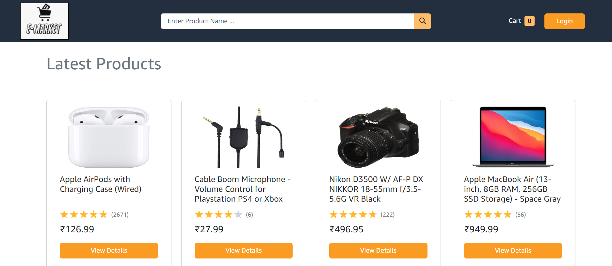
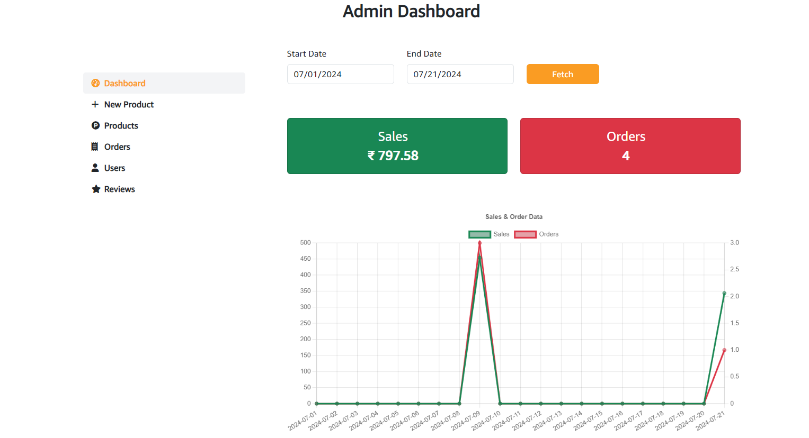
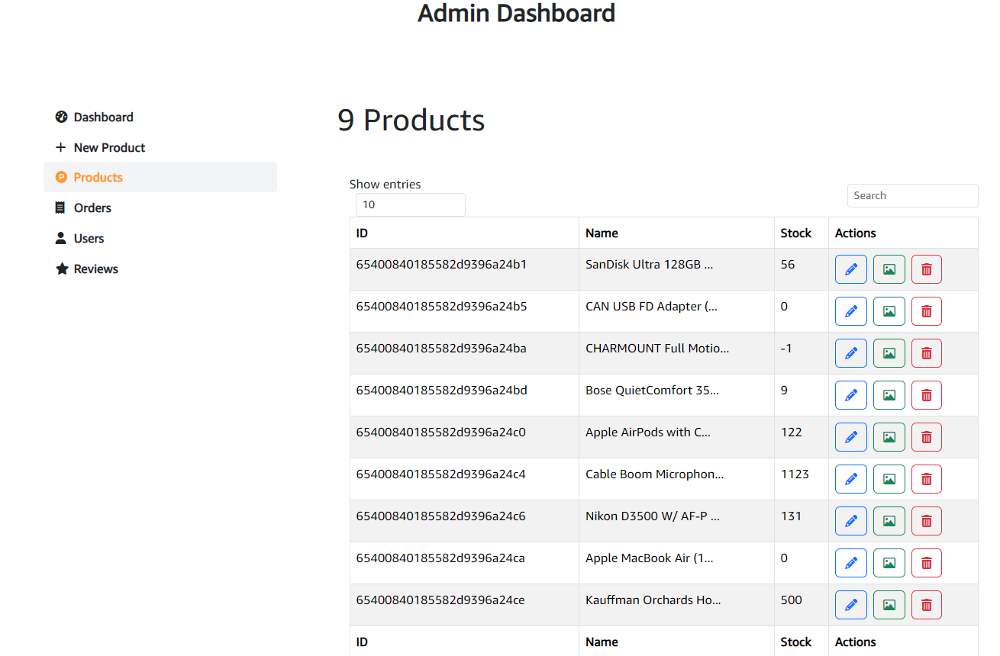
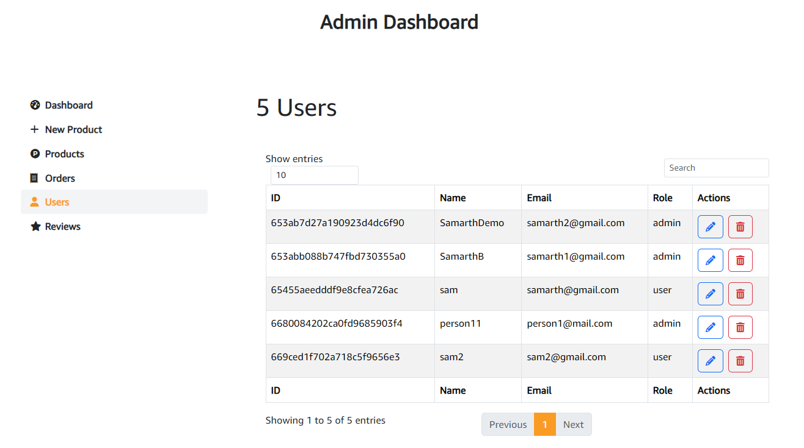
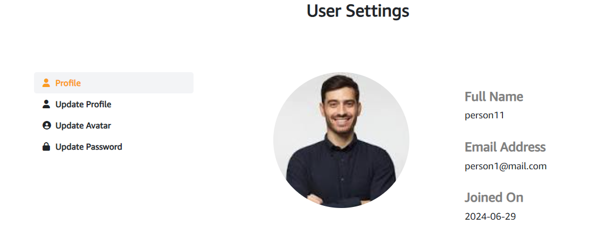
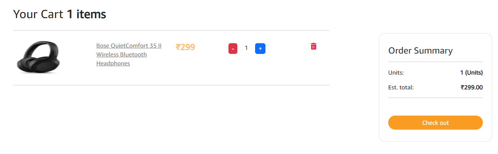
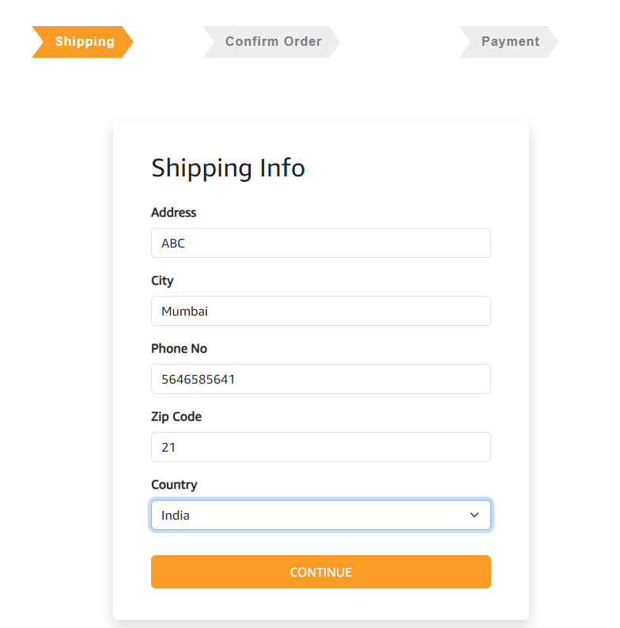

# E-Market 🛒  [GO](https://e-market-oe09.onrender.com/) 📌

Welcome to **E-Market**, your one-stop solution for all your e-commerce needs. Whether you're a customer looking to purchase products or a wholesaler/retailer wanting to take your business online, E-Market has got you covered.

### Note 📝

**E-Market** is my FS project deployed on render to showcase the integration and functionality of both backend and frontend technologies.

## Features ✨

### Authentication 🔐
- **User Registration and Login:** Secure registration and login for users.
- **Password Recovery:** Password recovery via email for forgotten passwords.

### Dashboard 📊
- **User Dashboard:** Personalized dashboard for customers to view their orders and account details.
- **Admin Dashboard:** Comprehensive dashboard for admins to manage products, orders, and users.

### Roles 👥
- **Admin Role:** Manage the entire platform, including user accounts, products, and orders.
- **User Role:** Browse products, place orders, and manage their own account.

### Payment Integration 💳
- **Stripe Integration:** Seamless payment processing with Stripe.

### Sales and Orders Chart 📈
- **Admin Charts:** Visual representation of sales and orders to help admins track performance.

### Invoice Generation 🧾
- **Automatic Invoices:** Generate invoices for each order placed on the platform.

### Order Status Change 🔄
- **Order Management:** Update and track the status of orders in real-time.

### Reviews and Ratings ⭐
- **Product Reviews:** Post reviews and star ratings for purchased products.

### Wholesale Features 🏷️
- **Product Listing:** Wholesalers can enter product details, including price and taxes, and list them on the website.
- **Order Management:** Wholesalers can track the orders they receive and view sales data through charts.

## Screenshots 📸

### Homepage


### Admin Dashboard


### Admin Products


### Users


### Profile


### Cart


### Checkout



## Responsiveness 🌐

**E-Market** is currently optimized for desktop use, showcasing a robust and fully functional design for larger screens. Future updates will focus on enhancing responsiveness across various devices.

## Getting Started 🚀

To get a local copy up and running, follow these steps:

### Prerequisites 📋
- Ensure you have Node.js and npm installed on your machine.

### Installation 🛠️

1. **Clone the repository:**
    ```sh
    git clone https://github.com/sgupt1802/E-Market.git
    ```
2. **Navigate to the project directory:**
    ```sh
    cd frontend
    ```
3. **Install the dependencies:**
    ```sh
    npm install
    ```

### Configuration ⚙️

1. **Create a `.env` file in the root directory and add your environment variables:**
    ```
    as mentioned in config
    ```

### Running the Application ▶️

1. **Start the development server:**
    ```sh
    npm start
    ```

## License 📄

Distributed under the MIT License. See `LICENSE` for more information.

## Contact 📧

Samarth Gupta - [sgupta_b21@it.vjti.ac.in](mailto:sgupta_b21@it.vjti.ac.in)

Project Link: [https://github.com/sgupt1802/E-market](https://github.com/sgupt1802/E-Market/)
